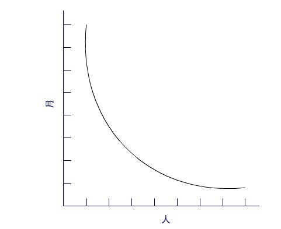
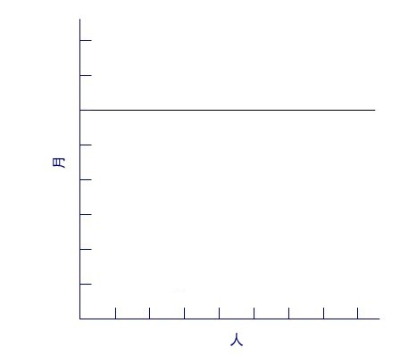
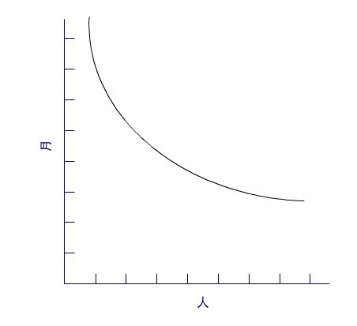
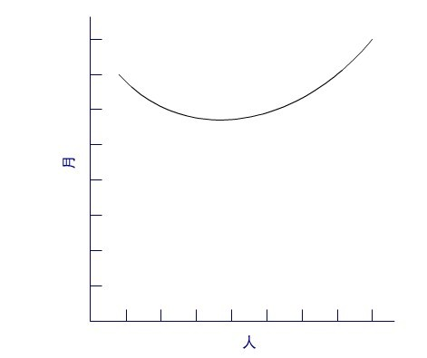

[人月神话：软件项目管理之道（The Mythical Man-Month: Essays on Software Engineering）](https://cactus-proj.github.io/The-Mythical-Man-Month-zh/)是由美国软件工程师暨 IBM System/360 系统之父佛瑞德·布鲁克斯（Fred Brooks）所著文集。全书讲解软件工程、项目管理相关课题，被誉为软件领域的圣经。内容源于作者布鲁克斯在 IBM 公司System/360 家族和 OS/360 中的项目管理经验。该书于 1975 年首次发行，并于 1995 年重新发行纪念版。
## 笔记
- 实际产品需要一步一步按阶段实现。实现落后与否的判断应根据其它已有的系统，而不是未实现的概念。因此，我们所面临的挑战和任务是在现有的时间和有效的资源范围内，寻找解决实际问题的切实可行方案。
- `编程是一个许多人痛苦挣扎的焦油坑以及一种乐趣和苦恼共存的创造性活动。`
- 在众多软件项目中，缺乏合理的时间进度是造成项目滞后的最主要原因，它比其他所有因素加起来的影响还大。缺乏合理时间进度的原因，有以下几点：
	- 对估算技术缺乏有效的研究。更加严肃地说，它反映了一种悄无声息，但并不真实的假设——一切都将运作良好。
	- 采用的估算技术隐含地假设人和月可以互换，错误地将进度与工作量相互混淆。
	- 对自己的估算缺乏信心，软件经理通常不会有耐心持续地进行估算这项工作。
	- 对进度缺少跟踪和监督。其他工程领域中，经过验证的跟踪技术和常规监督程序，在软件工程中常常被认为是无谓的举动。
	- 当意识到进度的偏移时，下意识（以及传统）的反应是增加人力。这就像使用汽油灭火一样，只会使事情更糟。越来越大的火势需要更多的汽油，从而进入了一场注定会导致灾难的循环。
- 所有的编程人员都是乐观主义者。可能是这种现代魔术特别吸引那些相信美满结局的人；也可能是成百上千琐碎的挫折赶走了大多数人，只剩下了那些习惯上只关注结果的人；还可能仅仅因为计算机还很年轻，程序员更加年轻，而年轻人总是些乐观主义者——无论是什么样的程序，结果是勿庸置疑的：“这次它肯定会运行。“或者”我刚刚找出了最后一个错误。“所以系统编程的进度安排背后的第一个假设是：一切都将运作良好，每一项任务仅花费它所“应该”花费的时间。
- 计算机编程基于十分容易掌握的介质，编程人员通过非常纯粹的思维活动——概念以及灵活的表现形式来开发程序。正由于介质的易于驾驭，我们期待在实现过程中不会碰到困难，因此造成了乐观主义的弥漫。而`我们的构思是有缺陷的，因此总会有 bug`。也就是说，我们的`乐观主义并不应该是理所应当的`。
- 成本的确随开发产品的人数和时间的不同，有着很大的变化，进度却不是如此。因此`用人月作为衡量一项工作的规模是一个危险和带有欺骗性的神话`。它暗示着人员数量和时间是可以相互替换的。
- 人数和时间的互换仅仅适用于以下情况：某个任务可以完全分解给参与人员，并且他们之间不需要相互的交流。这在割小麦或收获棉花的工作中是可行的，而在系统编程中近乎不可能。
	- 
- 当任务由于次序上的限制无法分解时，人手的添加对进度没有帮助。就像无论多少个母亲，孕育一个生命都需要十个月。由于调试、测试的次序特性，许多软件都具有这种特征。
	- 
- 对于可以分解，但子任务之间需要相互沟通和交流的任务，必须在计划工作中考虑沟通的工作量。因此，相同人月的前提下，采用增加人手来减少时间得到的最好情况，也比未调整前要差一些。沟通所增加的负担由两个部分组成：培训和相互的交流。每个成员需要进行技术、项目目标以及总体策略上的培训。这种培训不能分解，因此这部分增加的工作量随人员的数量呈线性变化。
	- 
- 如果任务的每个部分必须分别和其他部分单独协作，这是相互之间交流的情况，结果会更糟一些。一对一交流的情况下，工作量按照通信连接数的数学规律`n(n-1)/2` 递增。n 为参与交流的人数。而对于需要在三四个人之间召开会议、进行协商、一同解决的问题，情况会更加恶劣。所增加的用于沟通的工作量可能会完全抵消对原有任务分解所产生的作用。因为软件开发本质上是一项系统工作，是错综复杂关系下的一种实践。沟通和交流的工作量非常大，它很快会消耗任务分解所节省下来的个人时间。从而添加更多的人手，实际上是延长了，而不是缩短了时间进度。
	- 
- 在时间进度中，顺序限制所造成的影响，没有哪个部分比单元调试和系统测试所受到的牵涉更彻底。而且，要求的时间依赖于所遇到的错误、缺陷数量以及捕捉它们的程度。理论上缺陷的数量应该为零。但是，由于我们的乐观主义，通常实际出现的缺陷数量比预料的要多得多。
- 对于软件任务的进度安排，作者给出了一个使用了很多年的经验法则：`计划：编码：早期测试：系统测试 = 4:2:3:3`
	- 1/3 计划
	- 1/6 编码
	- 1/4 构件测试和早期系统测试
	- 1/4 系统测试（所有的构件均已完成后）
- 软件任务进度安排的特点
	- 分配给计划的时间比寻常的多。即便如此，仍不足以产生详细和稳定的计划规格说明，也不足以容纳对全新技术的研究和摸索。
	- 对所完成代码的调试和测试，需投入近一半的时间。
	- 容易估计的部分，即编码，仅仅分配了六分之一的时间。
- 在实际的项目开发中，`很少有项目允许为测试分配一半的时间，但大多数项目的测试实际上是花费了进度中一半的时间`。它们中的许多项目，在系统测试之前还能保持进度。或者说，除了系统测试，进度基本能保证。但不为系统测试安排足够的时间简直就是一场灾难。因为它会延迟发生在项目快完成的时候。也许直到项目的发布日期，才有人发现进度上的问题。因此，坏消息没有任何预兆，很晚才出现在客户和项目经理面前。此时此刻的延迟具有不寻常的、严重的财务和心理上的反应。在此之前，项目已经配置了充足的人员，每天的人力成本也已经达到了最大的限度。更重要的是，当软件用来支持其他的商业活动（计算机硬件到货，新设备、服务上线等等）时，这些活动延误出现即将发布前，那么将付出相当高的商业代价。实际上，上述的二次成本远远高于其他开销。因此，在早期进度策划时，允许充分的系统测试时间是非常重要的。
- 编程人员如同厨师一样。某项任务的计划进度，可能受限于顾客要求的紧迫程度，但紧迫程度无法控制实际的完成情况。就像约好在两分钟内完成一个煎蛋，看上去可能进行得非常好。但当它无法在两分钟内完成时，顾客只能选择等待或者生吃煎蛋。厨师还有其他的选择：他可以把火开大，不过结果常常是无法“挽救”的煎蛋——一面已经焦了，而另一面还是生的。软件顾客的情况类似。对软件经理而言，为了满足顾客期望的日期而造成的不合理进度安排，在软件领域中却比其他的任何工程领域要普遍得多。而且，非阶段化方法的采用，少得可怜的数据支持，加上完全借助软件经理的直觉，这样的方式很难生产出健壮可靠和规避风险的估计。显然需要两种解决方案：
	- 一：开发并推行生产率图表、缺陷率、估算规则等等，而整个组织最终会从这些数据的共享上获益。
	- 二：在基于可靠基础的估算出现之前，项目经理需要挺直腰杆，坚持他们的估计，确信自己的经验和直觉总比从期望派生出的结果要强得多。
- 当一个软件项目落后于进度时，通常的做法是加派人手。但是这种做法可能有所帮助，也可能无法解决问题。Brooks 法则：`向进度落后的项目中增加人手，只会使进度更加落后。（Adding manpower to a late software project makes it later）`
- 项目的时间依赖于顺序上的限制，人员的数量依赖于单个子任务的数量。从这两个数值可以推算出进度时间表，该表安排的人员较少，花费的时间较长（唯一的风险是产品可能会过时）。相反，分派较多的人手，计划较短的时间，将无法得到可行的进度表。
- 